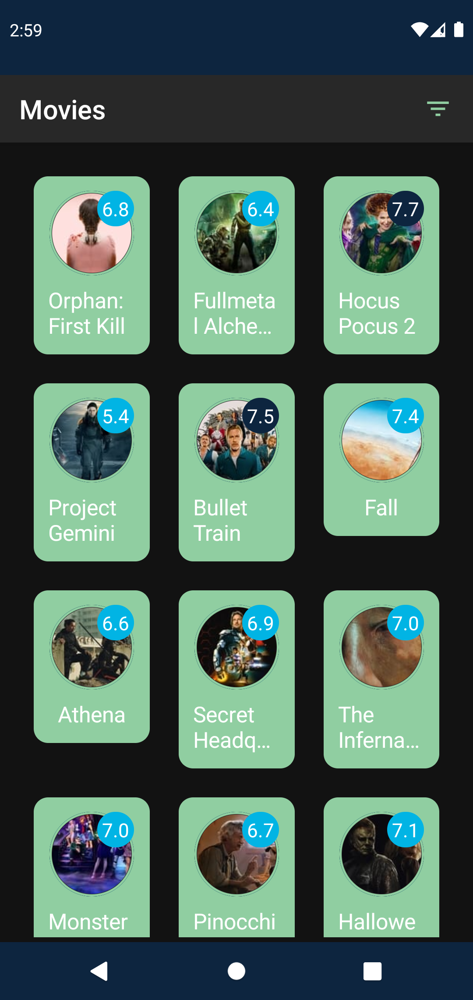
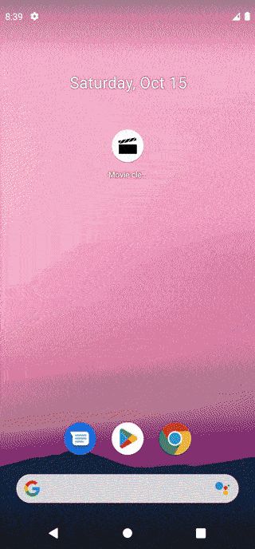
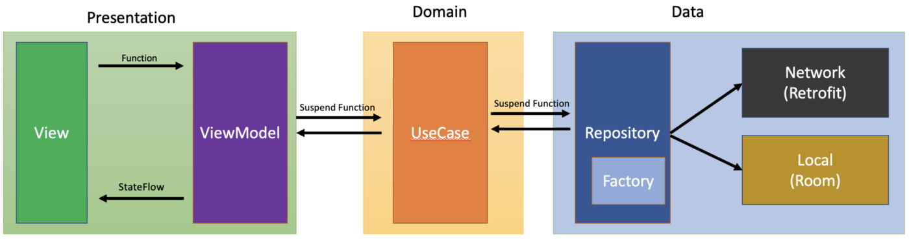
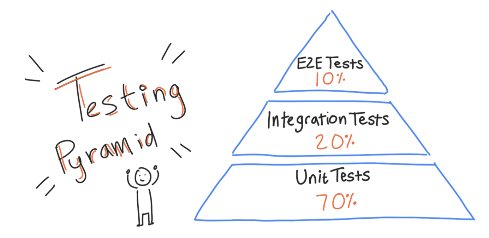

# Movie-clean
Simple Movie app with two screens tested (Unit &amp; Integration) testing implemented with clean arch and last tech in android.

## ScreenShots:

  
  
  
  

## Demo

  

## APK Download
[Click here](https://drive.google.com/file/d/15yxJwuv35lZ2-g77FJnGheyvP9xcccKq/view?usp=sharing)

## In-App architecture

  

## In-App Testing

  

Unit testing for:
- LocalMoviesPaginSource
- RemoteMoviesPaginSource
- Some utils funs

UI test cases:
- moviesScreen_is_app_bar_displayed()
- moviesScreen_open_filter_popup()
- moviesScreen_open_movie_details_screen()
- moviesScreen_open_movie_details_screen_then_back()

## Features
- Dark and light mode
- Offline cashing
- Obfuscation
- Simple UI
- Animations
- Config changes handling

## Tools & APIs
- Jetpack Compose
- Compose navigation
- Clean architecture
- MVVM arch pattern
- Coroutines
- Channels & flows
- Paging3
- Retrofit
- Room
- Coil
- Unit testing
- UI testing 
- Proguard

## Resources
- API
  - [Movie API](https://www.themoviedb.org/documentation/api)
  
- Clean Arch
  - [Android Apps Using MVVM With Clean Architecture](https://www.toptal.com/android/android-apps-mvvm-with-clean-architecture)
  - [Guide on Android Clean Architecture](https://mirror-medium.com/?m=https://medium.com/android-dev-hacks/detailed-guide-on-android-clean-architecture-9eab262a9011&xt=true)
  - [Clean Architecture Tutorial for Android](https://www.raywenderlich.com/3595916-clean-architecture-tutorial-for-android-getting-started)

- Navigation
  - [Compose navigation - Codelab](https://developer.android.com/codelabs/jetpack-compose-navigation#5)
  - [Compose navigation](https://developer.android.com/jetpack/compose/navigation)
  - [Adding a Hilt ViewModel to the Navigation graph](https://proandroiddev.com/jetpack-compose-adding-a-hilt-viewmodel-to-navigation-28cdc95e28bb)

- Pagination
  - [Page from network and database](https://developer.android.com/topic/libraries/architecture/paging/v3-network-db)
  - [Android Paging Advanced codelab](https://developer.android.com/codelabs/android-paging#0) 
  - [Room paging](https://genicsblog.com/gouravkhunger/pagination-in-android-room-database-using-the-paging-3-library) 
  
  
- Testing
  - [Basic Testing codelab](https://developer.android.com/codelabs/advanced-android-kotlin-training-testing-test-doubles#0)
  - [Test paging source](https://medium.com/@mohamed.gamal.elsayed/android-how-to-test-paging-3-pagingsource-433251ade028)
  - [Testing your Compose layout](https://developer.android.com/jetpack/compose/testing#assertions)
  - [Write automated tests with UI Automator](https://developer.android.com/training/testing/other-components/ui-automator)
  - [Testing cheatsheet](https://developer.android.com/jetpack/compose/testing-cheatsheet)
  - [Testing in Jetpack Compose - codelab](https://developer.android.com/codelabs/jetpack-compose-testing)

